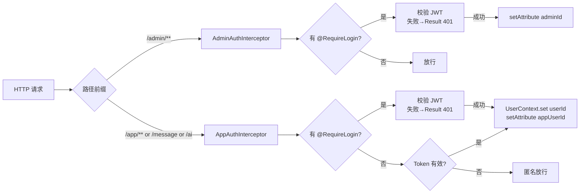
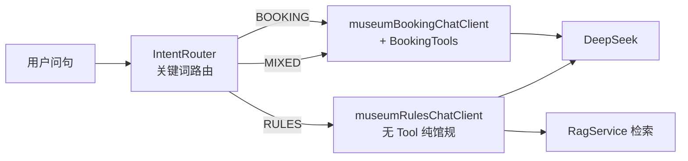

# 架构设计 · ARCHITECTURE

## 1. 总体架构

系统采用**三端一体 + 单体后端**架构。后端是唯一的业务事实来源，管理端与小程序端通过 REST API 共享同一套服务。AI Agent 不是独立服务，而是后端的一个模块，复用既有预约/馆规业务能力。

```mermaid
graph TB
    subgraph 客户端
        MP[微信小程序<br/>21 页 / 4 TabBar]
        ADMIN[Vue 3 管理端<br/>13 视图]
    end
    subgraph 后端 Spring Boot 8081
        ICPT[拦截器层<br/>AppAuthInterceptor / AdminAuthInterceptor]
        CTRL[Controller 层<br/>controller/admin + controller/app + AiChatController]
        SVC[Service 层<br/>业务编排]
        STOCK[BookingStockService<br/>Redis Lua 预扣]
        AGENT[AiChatService<br/>双 ChatClient + 5 Tool]
        RAG[RagService<br/>内存向量库]
        AI_TOOL[BookingTools<br/>@Tool 适配层]
        DAO[Mapper 层<br/>MyBatis-Plus]
    end
    subgraph 存储
        MYSQL[(MySQL<br/>museum_book)]
        REDIS[(Redis<br/>stock / booked)]
        LLM[DeepSeek API<br/>OpenAI-compatible]
    end

    MP -- Token 头 --> ICPT
    ADMIN -- Bearer Token --> ICPT
    ICPT --> CTRL
    CTRL --> SVC
    SVC --> STOCK
    SVC --> DAO
    STOCK -- Lua --> REDIS
    STOCK -- 事务 --> MYSQL
    CTRL --> AGENT
    AGENT --> AI_TOOL
    AI_TOOL --> SVC
    AGENT --> RAG
    AGENT --> LLM
    DAO --- MYSQL
```

## 2. 后端分层

包结构 `com.museum` 下自外向内分层：

| 层 | 包 | 职责 |
|----|----|------|
| 表现层 | `controller.admin` / `controller.app` / `controller` | 接收请求、参数校验、调用 Service、包装 `Result` |
| 鉴权层 | `security` + `annotation` | `AppAuthInterceptor` / `AdminAuthInterceptor` + `@RequireLogin` / `@RequirePermission` |
| 业务层 | `service` + `service.impl` | 领域编排：预约、库存、黑名单、消息、统计、导出 |
| AI 层 | `ai.*` | 双 ChatClient、5 Tool、RAG、意图路由、调试追踪 |
| 数据层 | `mapper` + `resources/mapper/*.xml` | MyBatis-Plus CRUD + 自定义 SQL（JOIN/批量更新） |
| 实体层 | `entity` | 14 张表实体 + 非持久化计算字段 |
| 通用层 | `common` | `Result`、`ErrorCode`、`BusinessException`、`JwtUtil`、`IdGenerator`、`QRCodeUtil` |
| 配置层 | `config` / `common.config` | CORS、MyBatis-Plus、事务、WebMvc、Swagger、Redis |
| 定时任务 | `job.BookingScheduler` | 爽约扫描 / 自动拉黑 / 自动解禁 |

### 2.1 控制器拆分原则

- `controller/admin/*` —— 管理端后台接口，类级 `@RequireLogin`，路径前缀 `/admin`
- `controller/app/*` —— 小程序端接口，路径前缀 `/app`；写操作 `@RequireLogin`，读操作开放
- `controller/AiChatController` —— `/ai/chat`，**可选登录**（无注解，靠拦截器软注入 `UserContext`）
- `controller/MessageController` / `AdminMessageController` —— 消息中心

### 2.2 基类复用

`controller/app/BaseAppController` 提供 `getUserId()`，从请求属性 `appUserId` 取登录用户 ID，供 `AppBookingController` / `AppRecordController` 等复用。

## 3. 鉴权与请求上下文

### 3.1 双拦截器



关键点：
- **管理端**支持 `Authorization: Bearer <token>` 或 `Token: <token>` 两种头
- **小程序端**统一用 `Token: <token>` 头
- `/ai/chat` **不加** `@RequireLogin`，但拦截器会把有效 Token 的 `userId` 软注入 `UserContext`；无 Token 时匿名放行，AI 写 Tool 会因 `userId == null` 自行失败

### 3.2 UserContext（ThreadLocal）

`ai/context/UserContext` 是 AI 写操作绑定的核心：
- 请求开始时由 `AppAuthInterceptor` 清空并按 Token 注入
- `BookingTools` 的写 Tool 通过 `UserContext.get()` 取 userId，**不从参数接收**
- 请求结束 `afterCompletion` 清空，防止线程池泄漏

> 设计意图：AI 模型不可通过构造参数伪造他人 `userId`，写操作权限与 HTTP 会话强绑定。

## 4. 预约库存子系统（面试托底）

详见 [FLOWS.md §1](./FLOWS.md)。核心模式：

```
请求内去重 → SETNX 预热 → Lua 原子预扣 → MySQL 事务落单(SUCC_CNT+=delta) → 失败/取消补偿
```

- Redis Key：`booking:stock:{timeMark}`、`booking:booked:{day}:{identityId}`
- Lua 脚本：`resources/lua/booking_reserve.lua`、`booking_compensate.lua`
- 一证一约：`booked` Key 的 TTL = 参观日结束 + 2h
- `SUCC_CNT` 用 SQL 原子自增，非应用层加锁
- 压测：80 并发同 `timeMark` 0 超卖（2026-08-16 JMeter）

## 5. AI Agent 子系统（主叙事）

详见 [FLOWS.md §2](./FLOWS.md)。架构要点：

### 5.1 双 ChatClient



- 两个 ChatClient 共用同一个 `ChatModel`（DeepSeek OpenAI-compatible），差异在**系统提示词**与**是否绑定 Tool**
- `museumRulesChatClient` **不绑定任何 Tool**，是安全屏障：馆规回答只许引用 RAG 片段，禁止编造
- 无 DeepSeek Key 时可选注入降级（返回配置提示），不阻断启动

### 5.2 五个固定 Tool（`ai/tool/BookingTools`）

| Tool | 类型 | 入参 | 出参 DTO |
|------|------|------|----------|
| `queryDays` | 读 | 无 | `QueryDaysData` |
| `queryTimes` | 读 | `day: yyyy-MM-dd` | `QueryTimesData` |
| `submitBooking` | 写 | `timeMark`, `identityIds[]` | `SubmitBookingData` |
| `listRecords` | 读 | `day?`, `status?` | `ListRecordsData` |
| `cancelBooking` | 写 | `joinId` | `CancelBookingData` |

约束：
- Tool 层只做 DTO / Converter / Service 适配，**不写 SQL、不碰 Redis、不承载库存事务**
- 写 Tool 取 `UserContext.get()`，无登录返回 `ToolError.UNAUTHORIZED`
- AI 暴露语义化字段（`BookingStatus` / `SlotAvailStatus` / `DayOpenStatus`），不直接暴露数据库状态码

### 5.3 轻量 RAG

- **Embedding**：`LocalHashingEmbeddingModel`，本地字符 n-gram 哈希（384 维），无网络调用、不依赖 DeepSeek embeddings
- **存储**：`InMemoryRagStore`（`CopyOnWriteArrayList` + 预计算向量），余弦相似度 Top-K
- **语料**：`NewsRagLoader`（`NoticeService#listVisibleForRag` 全量可见公告）+ `StaticRulesLoader`（`classpath:rag/visit-rules.md`）
- **配置**：`museum.ai.rag.*`（`enabled` / `top-k` / `min-score` / `rebuild-on-startup`）
- 改 `noticeReservation.wxml` 须同步 `visit-rules.md`（见 `docs/scripts/sync-visit-rules.md`）

### 5.4 响应协议（`AiChatResponse`）

```json
{
  "reply": "...",                      // 文本回复（兼容旧前端）
  "intent": "BOOKING | RULES | MIXED",
  "blocks": [ { "type": "time_slots | booking_records | rules_source | tips", ... } ],
  "suggestions": ["后天下午有票吗", "我的预约", "可以带背包吗"],
  "debug": { "intent": "...", "ragHits": [...], "tools": [...], "elapsed": 234 }
}
```
`debug` 字段仅在请求头 `X-AI-Debug: 1` 时返回，不影响前端默认协议。

## 6. 设计模式与关键决策

### 6.1 统一响应格式
所有接口返回 `Result<T>`（`{code, msg, data}`），HTTP 恒为 200，业务结果由 `code` 表达。错误码分 8 类（success / auth / user / identity / booking / checkin / internal），见 `common/exception/ErrorCode`。`GlobalExceptionHandler` 兜底 `BusinessException` 与未知异常。

### 6.2 双主键策略
每张表既有 `_id`（UUID，MyBatis-Plus 主键）又有业务 ID（如 `ADMIN_ID` / `USER_ID`）。业务 ID 用于日志关联与对外暴露，便于审计且不因主键变化级联改动。

### 6.3 JSON 列存储
`MUSEUM_OBJ` / `ACTIVITY_OBJ` / `JOIN_FORMS` 等用 `LONGTEXT` 存 JSON。`JOIN_FORMS` 是**预约时表单快照**，落单后不可变，供合规与争议追溯。

### 6.4 反范式与计算字段
- `log.LOG_ADMIN_NAME` 反范式存操作人名，避免查日志时 JOIN 已被删除的管理员
- `Join` 实体的 `museumTitle` / `museumAddress` / `joinMeetTimeStart` 等为 `@TableField(exist=false)` 计算字段，由 Mapper `LEFT JOIN` 填充，减少 N+1

### 6.5 库存取数 O(1)
`time` 表以 `TIME_MARK`（场馆+日期+时段）为唯一键，`LIMIT_CNT` / `SUCC_CNT` 同列存放，配额校验无需 JOIN，O(1) 查询。

### 6.6 黑名单与爽约闭环
- `IDENTITY_CARD` 唯一索引，去重 + 拉黑检测
- `BookingScheduler` 定时扫描：过参观日未核销 → `JOIN_IS_CHECKIN=3` → 累计 `USER_BAN_NUM` → 超阈值自动 `doBan()` → 到期 `autoUnban()`
- `USER_CHECK_TYPE` 区分自动(1) / 人工(0)拉黑，支撑申诉流程

### 6.7 多租户预留
所有表带 `_pid` 字段，软多租户过滤，单库可服务多个博物馆系统（当前未启用分库）。

### 6.8 单体而非微服务
- AI Agent 复用既有 `JoinService` / `NoticeService`，**不新增第二套预约主链路**
- 固定 5 Tool、单 Agent、内存 RAG，刻意不引入 LangGraph / MCP / 多 Agent / Milvus
- 决策动机：简历可解释、可验收、链路收敛；避免过度工程

## 7. 跨层调用矩阵

| 调用方 | 被调方 | 介质 |
|--------|--------|------|
| Controller | Service | Spring 注入 |
| Service | Mapper | MyBatis-Plus |
| `JoinServiceImpl` | `BookingStockService` | Spring 注入（库存事务编排） |
| `BookingStockService` | Redis | `RedisTemplate.execute(RedisScript)` Lua |
| `BookingTools` | `JoinService` / `DayService` / `TimeService` | Spring 注入（Tool 适配层不直接访问 DAO） |
| `AiChatService` | 双 `ChatClient` + `RagService` | Spring 注入 |
| `RagService` | `NoticeService` + `StaticRulesLoader` | 启动重建 + 检索 |
| `AppAuthInterceptor` | `UserContext`（ThreadLocal） | 请求生命周期内 |

## 8. 配置要点（`application.yml`）

| 配置 | 值 / 说明 |
|------|-----------|
| `server.port` | 8081 |
| `spring.datasource.url` | `jdbc:mysql://localhost:3306/museum_book` |
| `spring.data.redis` | localhost:6379（无密码） |
| `spring.ai.openai.base-url` | `https://api.deepseek.com` |
| `spring.ai.openai.chat.options.model` | `deepseek-v4-flash` |
| `mybatis-plus.mapper-locations` | `classpath*:/mapper/**/*.xml` |
| `mybatis-plus.configuration.map-underscore-to-camel-case` | true |
| `museum.ai.rag.*` | `enabled/top-k/min-score/rebuild-on-startup` |

> 注意：真实 DeepSeek Key 写在 `spring.ai.openai.api-key`（字符串直填，不用 `${}`），提交前必清。
