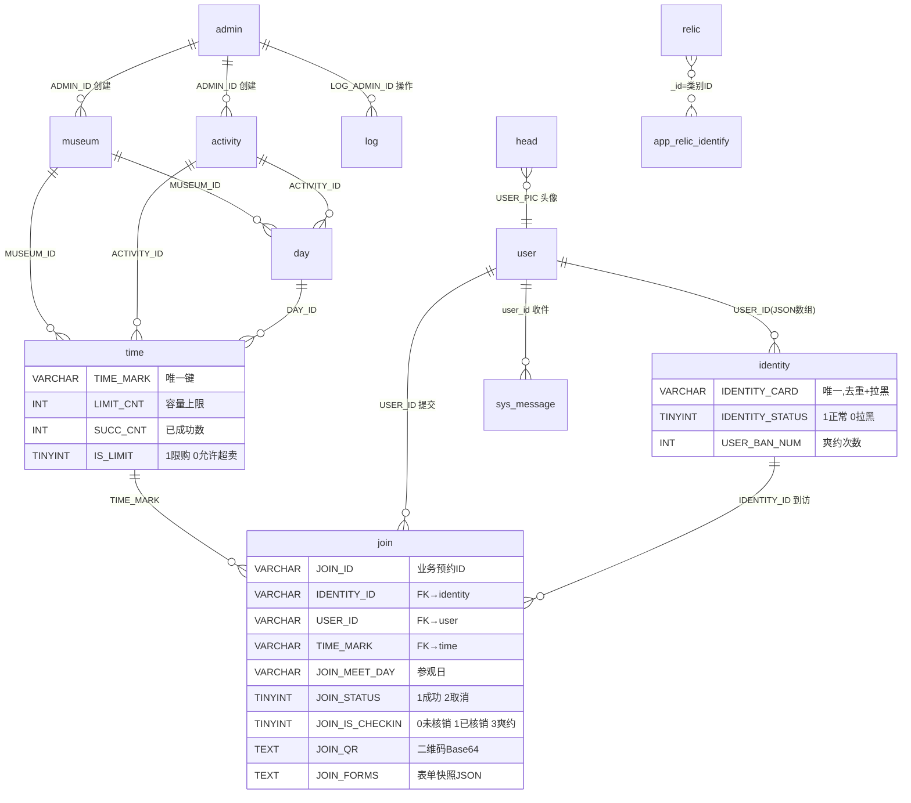

# 数据库设计 · DATABASE

> 库名 `museum_book`，MySQL 8.0。所有表（除 `sys_message*`）使用**双主键策略**：`_id`（VARCHAR 64 UUID，MyBatis-Plus 主键）+ 业务 ID（如 `USER_ID`）。
> 初始化脚本见 `docs/sql/`：`museum_book_schema.sql`（DDL）、`museum_book_seed_base.sql`（种子）、`museum_book_seed_loadtest.sql`（压测）。

## 1. ER 概览

## 2. 表清单

| # | 表名 | 实体类 | 角色 |
|---|------|--------|------|
| 1 | `admin` | Admin | 管理员 |
| 2 | `museum` | Museum | 场馆 |
| 3 | `activity` | Activity | 活动 |
| 4 | `user` | User | 小程序账号用户 |
| 5 | `identity` | Identity | 访客身份（按身份证去重） |
| 6 | `day` | Day | 每日排期 |
| 7 | `time` | Time | 时段（库存单元） |
| 8 | `join` | Join | ★ 预约记录核心表 |
| 9 | `news` | News | 公告/推文 |
| 10 | `log` | Log | 操作日志 |
| 11 | `head` | Head | 头像 |
| 12 | `relic` | Relic | 文物（ONNX 类别对应） |
| 13 | `sys_message` | Message | 用户系统消息 |
| 14 | `sys_message_template` | MessageTemplate | 消息模板 |

## 3. 表结构详解

### 3.1 admin · 管理员

| 字段 | 类型 | 说明 |
|------|------|------|
| `_id` | VARCHAR(64) | PK |
| `ADMIN_ID` | VARCHAR(64) | 业务 ID |
| `ADMIN_NAME` | VARCHAR(50) | 登录名 |
| `ADMIN_PASSWORD` | VARCHAR(255) | 加密密码 |
| `ADMIN_TOKEN` | VARCHAR(255) | JWT |
| `ADMIN_TOKEN_TIME` | BIGINT | Token 时间 |
| `ADMIN_ADD_TIME` | BIGINT | 创建时间 |
| `ADMIN_NICKNAME` | VARCHAR(50) | 昵称 |
| `ADMIN_INTRO` | TEXT | 简介 |
| `ADMIN_AVATAR` | VARCHAR(255) | 头像 URL |
| `ADMIN_INFO_UPDATE_TIME` | BIGINT | 资料更新时间 |
| `_pid` | VARCHAR(64) | 多租户标识 |

### 3.2 museum · 场馆

| 字段 | 类型 | 说明 |
|------|------|------|
| `_id` | VARCHAR(64) | PK |
| `MUSEUM_ID` | VARCHAR(64) | 业务 ID，索引 `idx_museum_id` |
| `MUSEUM_TITLE` | VARCHAR(255) | 名称 |
| `ADMIN_ID` | VARCHAR(64) | FK→admin |
| `MUSEUM_OBJ` | LONGTEXT | 详情 JSON |
| `MUSEUM_PIC` | LONGTEXT | 封面图 JSON 数组 |
| `MUSEUM_MAX_JOIN_CNT` | INT | 最大预约数 |
| `MUSEUM_BOOK_SET` | INT | 提前可预约天数 |
| `MUSEUM_STATUS` | TINYINT | 1启用 0停用 |
| `MUSEUM_ADD_TIME` / `MUSEUM_EDIT_TIME` | BIGINT | 时间戳 |
| `LATITUDE` / `LONGITUDE` | DOUBLE | 地图坐标 |
| `ADDRESS` | VARCHAR(550) | 地址 |
| `_pid` | VARCHAR(64) | 多租户 |

### 3.3 activity · 活动

| 字段 | 类型 | 说明 |
|------|------|------|
| `_id` | VARCHAR(64) | PK |
| `ACTIVITY_ID` | VARCHAR(64) | 业务 ID |
| `ACTIVITY_TITLE` | VARCHAR(255) | 标题 |
| `ADMIN_ID` | VARCHAR(64) | FK→admin |
| `ACTIVITY_OBJ` | LONGTEXT | 详情 JSON |
| `ACTIVITY_PIC` | LONGTEXT | 封面图 JSON |
| `ACTIVITY_STATUS` | TINYINT | 1发布 0下架 |
| `ACTIVITY_ADD_TIME` / `ACTIVITY_EDIT_TIME` | BIGINT | 时间戳 |
| `_pid` | VARCHAR(64) | 多租户 |

### 3.4 user · 小程序账号

| 字段 | 类型 | 说明 |
|------|------|------|
| `_id` | VARCHAR(64) | PK |
| `USER_ID` | VARCHAR(64) | 业务 ID，索引 `idx_user_id` |
| `USER_MINI_OPENID` | VARCHAR(128) | 微信 OpenID |
| `USER_NAME` | VARCHAR(100) | 昵称 |
| `USER_MOBILE` | VARCHAR(20) | 手机号，索引 `idx_user_mobile` |
| `USER_PIC` | INT | 头像 ID（FK→head） |
| `USER_ADD_TIME` / `USER_EDIT_TIME` | BIGINT | 时间戳 |
| `_pid` | VARCHAR(64) | 多租户 |
| `userPicUrl` | 非持久 | 计算字段：头像 URL |

### 3.5 identity · 访客身份

| 字段 | 类型 | 说明 |
|------|------|------|
| `_id` | VARCHAR(64) | PK |
| `IDENTITY_ID` | VARCHAR(64) | 业务 ID，索引 `idx_identity_id` |
| `USER_ID` | TEXT | 拥有者用户 ID 的 JSON 数组（N:N） |
| `IDENTITY_NAME` | VARCHAR(50) | 真实姓名 |
| `IDENTITY_CARD` | VARCHAR(30) | 身份证，**唯一索引** `uk_identity_card` |
| `IDENTITY_MOBILE` | VARCHAR(20) | 手机号 |
| `IDENTITY_OBJ` | TEXT | 扩展信息 JSON |
| `IDENTITY_STATUS` | TINYINT | 1正常 0拉黑 |
| `BLACK_START_TIME` / `BLACK_END_TIME` | BIGINT | 拉黑起止 |
| `USER_BAN_NUM` | INT | 爽约累计次数 |
| `USER_CHECK_TYPE` | TINYINT | 1自动拉黑 0人工拉黑 |
| `_pid` | VARCHAR(64) | 多租户 |

### 3.6 day · 每日排期

| 字段 | 类型 | 说明 |
|------|------|------|
| `_id` | VARCHAR(64) | PK |
| `DAY_ID` | VARCHAR(64) | 业务 ID |
| `DAY` | VARCHAR(20) | 日期 `yyyy-MM-dd` |
| `MUSEUM_ID` | VARCHAR(64) | FK→museum |
| `ACTIVITY_ID` | VARCHAR(64) | FK→activity |
| `STATUS` | TINYINT | 1开放 0闭馆 |
| `DAY_LIMIT_CNT` | INT | 当日总限额 |
| `ADD_TIME` / `EDIT_TIME` | BIGINT | 时间戳 |
| `_pid` | VARCHAR(64) | 多租户 |

> 复合索引 `idx_day_museum_date`（`MUSEUM_ID, DAY`），支撑日期可用性查询。

### 3.7 time · 时段（库存单元）

| 字段 | 类型 | 说明 |
|------|------|------|
| `_id` | VARCHAR(64) | PK |
| `TIME_ID` | VARCHAR(64) | 业务 ID |
| `DAY_ID` | VARCHAR(64) | FK→day |
| `MUSEUM_ID` / `ACTIVITY_ID` | VARCHAR(64) | FK |
| `TIME_START` / `TIME_END` | VARCHAR(10) | `HH:mm` |
| `TIME_MARK` | VARCHAR(64) | 唯一键 `uk_time_mark`（场馆+日期+时段） |
| `LIMIT_CNT` | INT | 容量上限 |
| `SUCC_CNT` | INT | 已成功预约数（原子自增） |
| `STATUS` | TINYINT | 1启用 0停用 |
| `IS_LIMIT` | TINYINT | 1限购 0允许超卖 |
| `ADD_TIME` / `EDIT_TIME` | BIGINT | 时间戳 |
| `_pid` | VARCHAR(64) | 多租户 |

> 配额校验：`SUCC_CNT < LIMIT_CNT` 或 `IS_LIMIT=0`，O(1) 查询无需 JOIN。

### 3.8 join · 预约记录（核心）

| 字段 | 类型 | 说明 |
|------|------|------|
| `_id` | VARCHAR(64) | PK |
| `JOIN_ID` | VARCHAR(64) | 业务 ID |
| `IDENTITY_ID` | VARCHAR(64) | FK→identity，索引 `idx_join_identity` |
| `USER_ID` | VARCHAR(64) | FK→user，索引 `idx_join_user` |
| `JOIN_MEET_DAY` | VARCHAR(20) | 参观日 |
| `TIME_MARK` | VARCHAR(64) | FK→time，索引 `idx_join_time_mark` |
| `JOIN_START_TIME` | BIGINT | 预约开始时间戳 |
| `JOIN_COMPLETE_END_TIME` | VARCHAR(50) | 结束时间字符串 |
| `JOIN_STATUS` | TINYINT | 1成功 2取消（不删除） |
| `JOIN_FORMS` | TEXT | 表单快照 JSON（不可变） |
| `JOIN_IS_CHECKIN` | TINYINT | 0未核销 1已核销 3爽约 |
| `JOIN_QR` | TEXT | 核销二维码 Base64 |
| `JOIN_ADD_TIME` / `JOIN_EDIT_TIME` | BIGINT | 时间戳 |
| `_pid` | VARCHAR(64) | 多租户 |
| `joinMeetTimeStart/End`, `museumTitle`, `museumAddress`, `latitude`, `longitude` | 非持久 | Mapper LEFT JOIN 填充 |

### 3.9 news · 公告

| 字段 | 类型 | 说明 |
|------|------|------|
| `_id` | VARCHAR(64) | PK |
| `NEWS_ID` | VARCHAR(64) | 业务 ID |
| `NEWS_TITLE` | VARCHAR(255) | 标题 |
| `NEWS_DESC` | TEXT | 内容 |
| `NEWS_STATUS` | TINYINT | 1发布 0下线 |
| `NEWS_VIEW_CNT` | INT | 浏览量 |
| `NEWS_ADD_TIME` / `NEWS_EDIT_TIME` | BIGINT | 时间戳 |
| `NEWS_ADD_IP` / `NEWS_EDIT_IP` | VARCHAR(64) | IP |
| `_pid` | VARCHAR(64) | 多租户 |

### 3.10 log · 日志

| 字段 | 类型 | 说明 |
|------|------|------|
| `_id` | VARCHAR(64) | PK |
| `LOG_ID` | VARCHAR(64) | 业务 ID |
| `LOG_CONTENT` | TEXT | 内容 |
| `LOG_TYPE` | INT | 0登录 99操作 |
| `LOG_ADMIN_ID` | VARCHAR(64) | FK→admin |
| `LOG_ADMIN_NAME` | VARCHAR(50) | 操作人名（反范式） |
| `LOG_ADD_TIME` / `LOG_EDIT_TIME` | BIGINT | 时间戳 |
| `_pid` | VARCHAR(64) | 多租户 |

### 3.11 head · 头像
| `_id` PK | `HEAD_PIC_ID` 业务 ID | `HEAD_PIC_URL` 完整 URL | `_pid` |

### 3.12 relic · 文物
| `_id` PK（= ONNX 模型类别 ID 0-4） | `RELIC_NAME` | `RELIC_DESC` LONGTEXT | `RELIC_IMAGE` |

### 3.13 sys_message · 用户消息

| 字段 | 类型 | 说明 |
|------|------|------|
| `id` | BIGINT AUTO | PK |
| `user_id` | VARCHAR(64) | FK→user，索引 `idx_user_id` |
| `title` | VARCHAR(100) | 标题 |
| `content` | TEXT | 内容 |
| `type` | TINYINT | 0系统 1预约 2活动 |
| `is_read` | TINYINT | 0未读 1已读 |
| `create_time` | DATETIME | 默认 `CURRENT_TIMESTAMP` |

### 3.14 sys_message_template · 消息模板

| 字段 | 类型 | 说明 |
|------|------|------|
| `id` | BIGINT AUTO | PK |
| `code` | VARCHAR(50) | 模板编码，唯一 `uk_code` |
| `title_template` | VARCHAR(100) | 标题模板 |
| `content_template` | TEXT | 内容模板 |
| `update_time` | DATETIME | 更新时间 |

## 4. 索引策略

| 表 | 索引 | 列 | 用途 |
|----|------|----|------|
| museum | idx_museum_id | MUSEUM_ID | 业务键查询 |
| user | idx_user_id | USER_ID | 用户资料 |
| user | idx_user_mobile | USER_MOBILE | 手机号登录 |
| identity | uk_identity_card | IDENTITY_CARD | 去重 + 拉黑（唯一） |
| identity | idx_identity_id | IDENTITY_ID | 访客资料 |
| day | idx_day_museum_date | (MUSEUM_ID, DAY) | 日期可用性 |
| time | uk_time_mark | TIME_MARK | 时段唯一（唯一） |
| join | idx_join_identity | IDENTITY_ID | 访客历史 |
| join | idx_join_user | USER_ID | 用户历史 |
| join | idx_join_time_mark | TIME_MARK | 时段占用 |
| sys_message | idx_user_id | user_id | 收件箱 |
| sys_message_template | uk_code | code | 模板编码（唯一） |

## 5. 关键关系

| 关系 | 从→到 | 类型 | 说明 |
|------|------|----|------|
| 创建者 | admin→museum/activity/log | 1:N | 管理员创建并操作 |
| 场馆排期 | museum→day | 1:N | 场馆有每日排期 |
| 排期时段 | day→time | 1:N | 一天多时段 |
| 活动映射 | activity→day/time | 1:N | 活动挂载到具体日期/时段 |
| 访客归属 | user↔identity | N:N | `identity.USER_ID` 为 JSON 数组，一用户可多访客 |
| 预约核心 | identity/user/time→join | 1:N | 三方关联到预约记录 |
| 头像引用 | head→user.USER_PIC | 1:1 | 头像链接 |
| 消息收件 | user→sys_message | 1:N | 用户收消息 |

## 6. 设计取舍

### 6.1 库存模型：`time` 表 + Redis 双层
- `time.LIMIT_CNT` / `SUCC_CNT` 同列存放，配额校验 O(1)
- 高并发下由 Redis Lua 原子预扣，MySQL `SUCC_CNT` 仅作持久化记账（`SUCC_CNT = SUCC_CNT + delta`）
- 详见 [FLOWS.md §1](./FLOWS.md)

### 6.2 身份证去重与黑名单
- `IDENTITY_CARD` 唯一索引：同一身份证全局只一条 `identity`
- `IDENTITY_STATUS` 软删除（0 拉黑），不物理删除
- `BLACK_*_TIME` 支持时段拉黑，到期 `autoUnban()` 自动解禁
- `USER_BAN_NUM` 超阈值（>5）自动 `doBan()`，`USER_CHECK_TYPE` 区分自动/人工

### 6.3 预约状态生命周期
- `JOIN_STATUS`：1 成功 / 2 取消，永不删除（审计完整）
- `JOIN_IS_CHECKIN`：0 待核销 / 1 已核销 / 3 爽约
- 状态 3 由 `BookingScheduler` 定时任务赋值（过 `JOIN_COMPLETE_END_TIME` 未核销）
- 状态 3 驱动 `USER_BAN_NUM` 累加与拉黑升级

### 6.4 表单快照不可变
`JOIN_FORMS` 落单时快照，后续即使访客资料变更也不影响历史预约记录，支撑合规与争议追溯。

### 6.5 反范式
- `log.LOG_ADMIN_NAME` 反范式存名，查日志不 JOIN（且管理员可能被删）
- `join` 计算字段由 Mapper LEFT JOIN 填充，减少 N+1

### 6.6 时间统一 BIGINT
所有业务时间用 BIGINT 毫秒，跨表比较与排序一致；`sys_message*` 例外用 DATETIME（MySQL 原生函数友好）。

### 6.7 多租户预留
`_pid` 字段全表覆盖，当前未启用分库但保留软多租户过滤能力。
