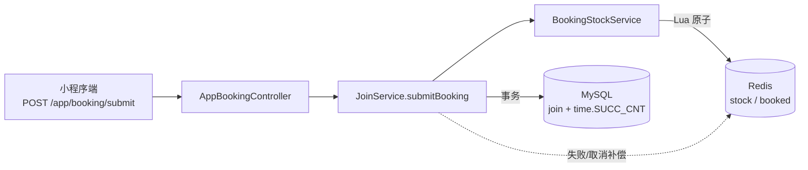
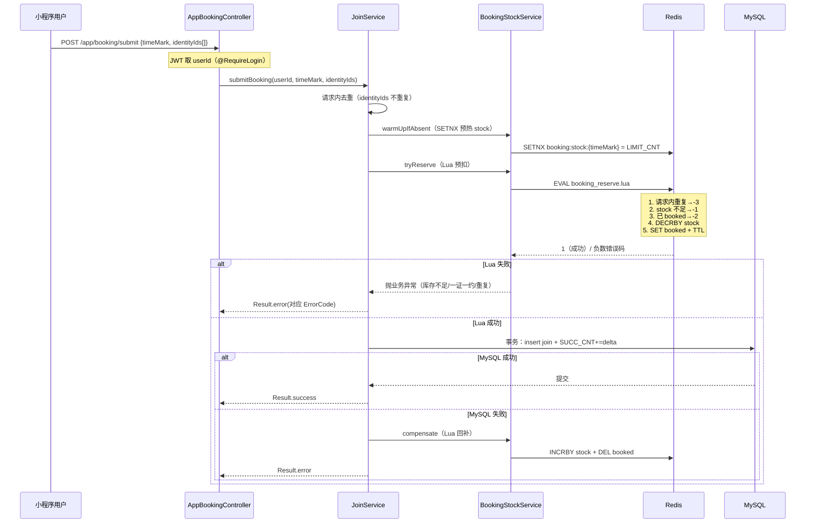
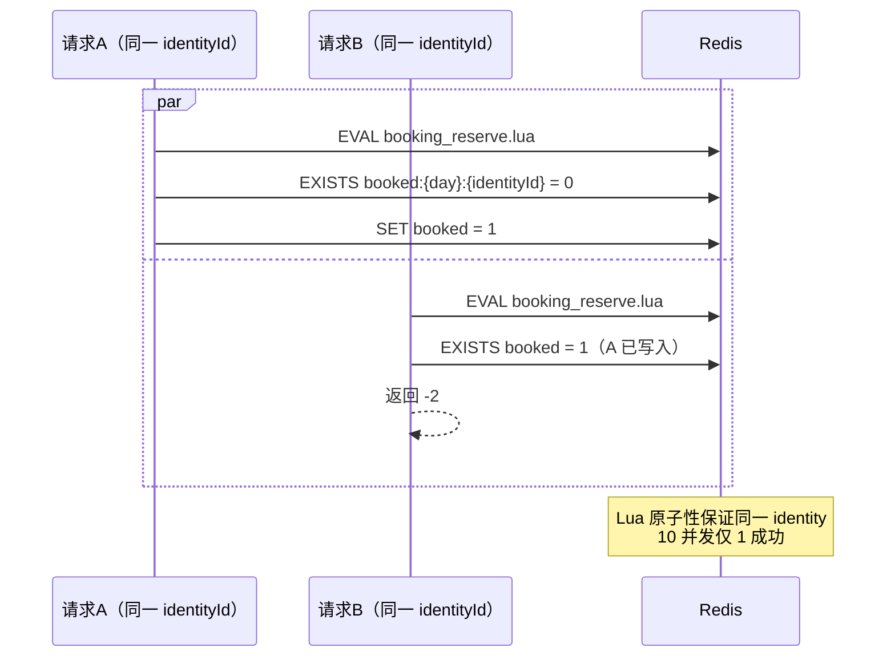
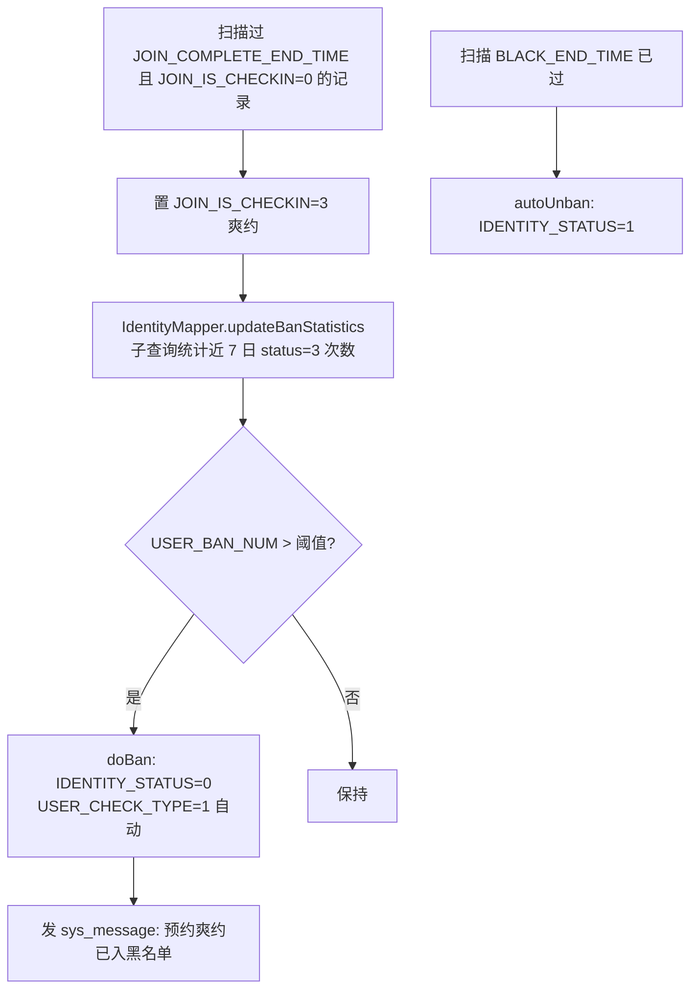
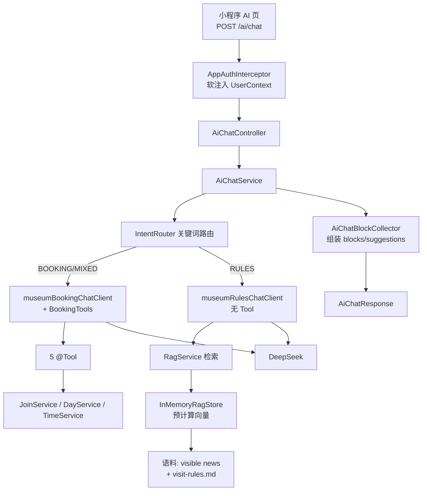
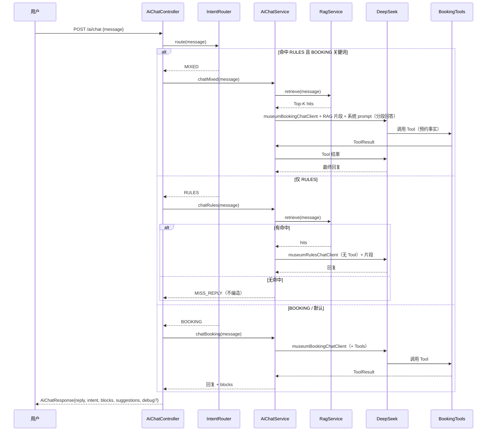
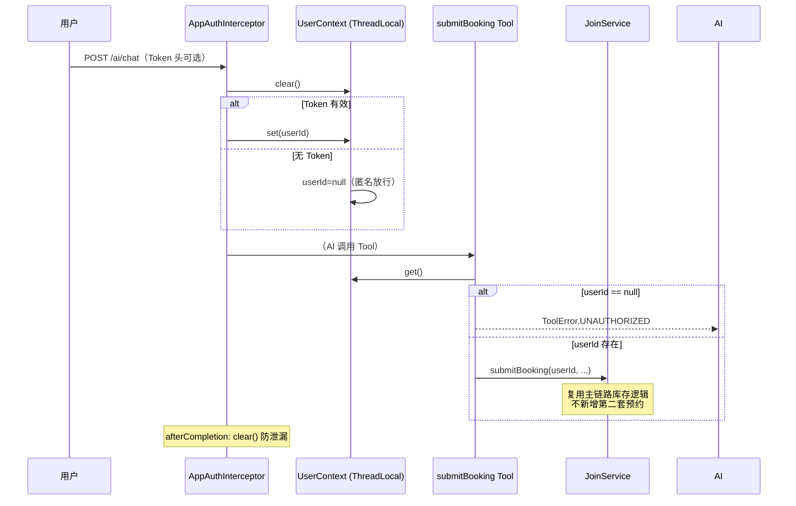
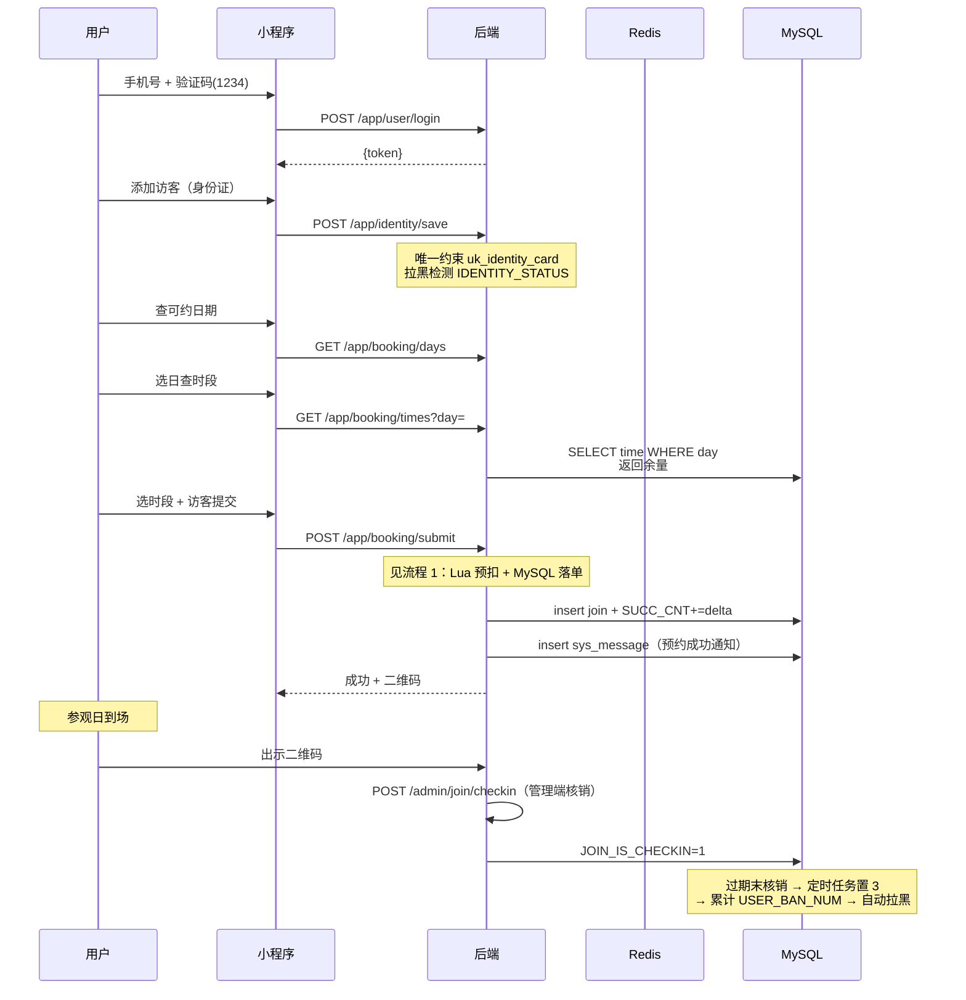
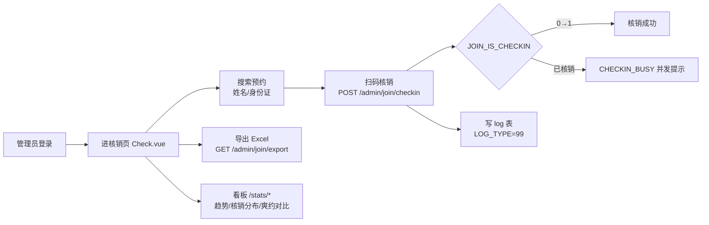

# 核心业务流程 · FLOWS

> 本文档用 Mermaid 描述两大核心子系统：**预约库存**（面试托底）与 **AI Agent + RAG**（主叙事）。
> 配套脚本/联调材料：`docs/jmeter/`、`docs/ai-agent-test-case.md`、`docs/ai-rag-test-case.md`。

---

## 流程 1：预约提交（Redis Lua 预扣 + MySQL 事务落单 + 补偿）

### 1.1 系统架构



### 1.2 提交时序



### 1.3 Redis Key 设计


| Key                                 | 形式       | 用途         | TTL             |
| ----------------------------------- | ---------- | ------------ | --------------- |
| `booking:stock:{timeMark}`          | 数值字符串 | 时段剩余库存 | 随排期          |
| `booking:booked:{day}:{identityId}` | `1`        | 一证一约标记 | 参观日结束 + 2h |

`timeMark` 形如 `museum_001_2025-12-30_09:00`（场馆+日期+时段），与 `time` 表唯一键一致。

### 1.4 Lua 脚本契约（`resources/lua/booking_reserve.lua`）

执行顺序对正确性至关重要：

1. 请求内去重：同一 `bookedKey` 出现两次 → 返回 `-3`
2. 库存校验：`GET stockKey`，对比 `need` → 不足返回 `-1`
3. 一证一约：`EXISTS` 每个 `bookedKey` → 已存在返回 `-2`
4. 原子预扣：`DECRBY stockKey need`
5. 写标记：`SET` 每个 `bookedKey = '1' EX ttl`
6. 返回 `1`

返回码：`1` 成功 / `-1` 库存不足 / `-2` 当日已约 / `-3` 请求内重复。

### 1.5 补偿（`resources/lua/booking_compensate.lua`）

- 触发：MySQL 落单失败 或 用户取消（`POST /app/record/cancel`）
- 动作：原子 `INCRBY stockKey` 还原库存 + `DEL` 全部 `bookedKey`
- `compensate()` 错误仅记录日志不抛出（fail-silent），由定时审计任务兜底对账
- 取消时：**MySQL 成功后**才补偿 Redis；Redis 失败不回滚 MySQL

### 1.6 一证一约并发



### 1.7 压测结论（2026-08-16 JMeter，本机真 Redis/MySQL）

- 场景 A 超卖：80 并发同 `timeMark`（`LIMIT_CNT=50`）→ 成功 50、业务失败 ~30；`SUCC_CNT=50`、`booking:stock=0`、**0 超卖**
- 场景 B 一证一约：同一 `identityId` 10 并发 → 成功 1；Redis 写入 `booking:booked:{day}:{identityId}`
- 不变量：`succCnt + Redis剩余 = limitCnt`
- 脚本：`docs/jmeter/`

### 1.8 爽约闭环（`BookingScheduler`，每 5 分钟）



---

## 流程 2：AI 对话（双 ChatClient + 5 Tool + 轻量 RAG）

### 2.1 系统架构



### 2.2 意图路由时序



### 2.3 五个 Tool 契约


| Tool            | 类型 | 入参                        | 返回 DTO            | 备注                                  |
| --------------- | ---- | --------------------------- | ------------------- | ------------------------------------- |
| `queryDays`     | 读   | —                          | `QueryDaysData`     | 全部可预约日 + 开/闭馆                |
| `queryTimes`    | 读   | `day`                       | `QueryTimesData`    | 某日时段 + 余量 + AVAILABLE/FULL      |
| `submitBooking` | 写   | `timeMark`, `identityIds[]` | `SubmitBookingData` | 需登录；调`JoinService.submitBooking` |
| `listRecords`   | 读   | `day?`, `status?`           | `ListRecordsData`   | 需登录；返回含`joinId`                |
| `cancelBooking` | 写   | `joinId`                    | `CancelBookingData` | 需登录；`joinId` 须来自 `listRecords` |

**写 Tool 绑定登录用户**：取 `UserContext.get()`，无登录返回 `ToolError.UNAUTHORIZED`；**不接受外部 `userId`**。

### 2.4 UserContext 注入与写操作安全



### 2.5 轻量 RAG 检索

```mermaid
flowchart LR
    Q[用户问句] --> EM[LocalHashingEmbeddingModel<br/>字符 n-gram 哈希 384 维]
    EM --> V[查询向量]
    V --> S[InMemoryRagStore.search]
    S --> COS[与全量预计算向量余弦相似度]
    COS --> F[Top-K 且 score ≥ min-score]
    F --> FMT[RagService.formatContext]
    FMT --> P[拼入 LLM prompt: [1] source=...]
```

- **Embedding**：本地哈希，无网络、不依赖 DeepSeek embeddings；unigram/bigram/trigram 加权哈希到 384 维后 L2 归一化
- **存储**：`CopyOnWriteArrayList` + 预计算向量，启动时 `rebuild-on-startup`
- **语料**：`NewsRagLoader`（`NoticeService#listVisibleForRag` 全量可见公告，HTML 清洗）+ `StaticRulesLoader`（`classpath:rag/visit-rules.md`）
- **配置**：`museum.ai.rag.{enabled,top-k=4,min-score=0.12,rebuild-on-startup=true}`
- **未命中**：返回 `MISS_REPLY`（"我目前没有查到相关馆规…"），**零编造**

### 2.6 响应协议与调试追踪

`AiChatResponse` = `reply + intent + blocks + suggestions + debug?`：

- `reply`：兼容旧前端
- `blocks`：`time_slots` / `booking_records` / `rules_source` / `tips`，前端按 `type` 渲染卡片
- `suggestions`：按 intent 给快捷追问
- `debug`：仅 `X-AI-Debug: 1` 时返回，含 `intent / ragHits / tools / elapsed`，由 `AiDebugTraceContext`（ThreadLocal）收集

---

## 流程 3：用户端预约全链路（小程序）



---

## 流程 4：管理端核销与对账（管理端）



---

## 关键不变量与边界


| 不变量                           | 保证机制                                                                   |
| -------------------------------- | -------------------------------------------------------------------------- |
| `succCnt + Redis剩余 = limitCnt` | Lua 原子预扣 + MySQL 原子自增 + 补偿对称                                   |
| 同一身份证当日仅 1 约            | `booking:booked:{day}:{identityId}` SET + TTL                              |
| AI 不编造预约事实                | 写 Tool 必须调真实 Service；RULES 路径不绑 Tool；RAG 未命中返回 MISS_REPLY |
| AI 写操作不可伪造他人 userId     | `UserContext` 取自 JWT，Tool 不接受参数 userId                             |
| 预约记录不可变审计               | `JOIN_STATUS` 不删除；`JOIN_FORMS` 落单快照                                |
| 爽约必拉黑                       | 定时任务闭环：置 3 → 累加`USER_BAN_NUM` → `doBan()` → 发消息            |
