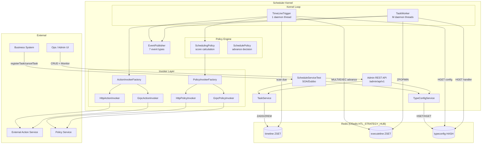

# Architecture

## System Overview



---

## Layered Architecture

| Layer | Package | Responsibility |
|-------|---------|---------------|
| **Entry** | `soa/`, `admin/` | Expose functionality via SOA (Dubbo) and REST |
| **Service** | `service/` | Business logic (TaskService, TypeConfigService) |
| **Kernel** | `kernel/` | Core scheduling loop (TimeLineTrigger, TaskWorker, SchedulerLifecycle) |
| **Policy** | `policy/` | Scheduling decisions (advance mode, score calculation, cron) |
| **Invoker** | `invoker/` | Protocol abstraction for HTTP/gRPC outbound calls |
| **Repository** | `redis/` | Redis data access (timeline, executeline, typeconfig) |
| **Domain** | `domain/` | Immutable value objects (TypeConfigDomain, ParsedMember, ScoredMember) |
| **Event** | `event/` | Internal pub-sub observability |
| **Config** | `config/` | Spring beans, Redis client, properties binding |
| **Mock** | `mock/` | Local development helpers (HTTP + gRPC mocks) |
| **Infra** | `vi/`, `cdubbo/` | Platform integration (VI ignite, CDubbo scan) |

---

## Design Patterns

### 1. Strategy + Factory (Invoker Layer)

The invoker system abstracts protocol differences behind a uniform interface:

```
ActionInvokerFactory
  ├── HttpActionInvoker     (kind = "http")
  ├── GrpcActionInvoker     (kind = "grpc")
  └── UnsupportedActionInvoker (unknown kind → fail fast)
```

- Factory dispatches by `handler.kind` from typeconfig
- Each invoker handles its own retry classification, CAT logging, and error mapping
- New protocols can be added by implementing `ActionInvoker` and registering in factory

### 2. Repository Pattern (Redis Layer)

Three repositories abstract Redis operations:

| Repository | Redis Type | Purpose |
|-----------|-----------|---------|
| `TimelineRepository` | ZSET | Task scheduling queue (score = timestamp) |
| `ExecutelineRepository` | ZSET | Execution priority queue (score = policy score) |
| `TypeConfigRepository` | HASH | Per-action configuration (JSON values) |

### 3. Observer Pattern (Event System)

Synchronous in-memory pub-sub for observability:

```
ScheduleEventPublisher
  ├── LoggingScheduleEventListener (default, logs all events)
  └── [custom listeners can be added]
```

- Thread-safe via `CopyOnWriteArrayList`
- Listener failures are caught and logged (never break main flow)
- 7 event types covering the full task lifecycle

### 4. Registry Pattern (gRPC Routes)

`GrpcActionRouteRegistry` maps `RouteKey(service, method)` → adapter implementations. Only pre-registered routes are accepted by `putTypeConfig`.

### 5. Builder Pattern (Events)

`ScheduleEvent.Builder` provides flexible construction with many optional fields. Only relevant fields are populated per event type.

---

## Key Architectural Decisions

### Redis-Only Storage

No relational database. All state lives in Redis:
- **Advantage:** Simple, fast, atomic operations via MULTI/EXEC
- **Trade-off:** No persistent history, no complex queries
- **Mitigation:** Events provide observability; admin API provides bounded queries

### Dual-Queue Model (Timeline + Executeline)

Separating "when to trigger" from "what to execute now" enables:
- Independent tuning of trigger frequency and execution priority
- Atomic advance via MULTI/EXEC (no lost tasks)
- Policy-driven prioritization at execution time

### Member Encoding

Tasks are encoded as `{value1};{value2};...;{action_id}` in Redis ZSET members:
- Opaque value segments (scheduler doesn't parse business meaning)
- Trailing `action_id` enables config lookup
- Semicolon delimiter (no segment may contain `;`)

### Configurable Key Prefix

`RedisKeys.applyPrefix()` enables multi-tenant isolation:
- Empty (default): bare keys for production
- `scheduler-local:<user>:`: developer sandbox
- `scheduler-it:`: integration test isolation

### Single-Leader Timeline Advance

TimeLineTrigger runs on 1 thread; batch advances via pipeline for throughput:
- Trades per-member atomicity for O(1) RTT
- Acceptable because only one thread writes timeline
- Failed members retry next cycle

### Policy Degradation

External Policy calls degrade gracefully:
- Timeout/error → built-in default score (once=1000, interval=2000, cron=3000, fixed_delay=4000)
- Advance never blocks on Policy failure
- Degradation flag propagated in events for monitoring

---

## Thread Model

| Thread | Count | Role | Sleep Policy |
|--------|-------|------|-------------|
| TimeLineTrigger | 1 | Scan timeline, advance due tasks | 50ms (busy) / 10s (idle) |
| TaskWorker | M (default 8) | Pop executeline, invoke actions | 50ms (busy) / 60s (idle) |

All threads are daemon threads managed by `SchedulerLifecycle`:
- `@PostConstruct` starts all threads
- `@PreDestroy` interrupts with 3-second graceful timeout
- `AtomicBoolean running` prevents double-start

---

## Transaction Strategies

### 1. Single-Key Atomicity
- `add`, `remove`, `getScore` rely on Redis single-command atomicity

### 2. MULTI/EXEC (Advance)
-联合写入 timeline + executeline in one transaction
- WATCH detects conflicts; retry on EXEC null
- Used by `advanceRemove`, `advanceUpdate`

### 3. Pipeline Batch (High Throughput)
- `batchAdvance` pipelines all commands in one RTT
- Per-member non-atomic (acceptable under single-leader)
- Failed members retry next cycle

### 4. popMin (No ZPOPMIN API)
- WATCH + ZRANGE[0,0] + MULTI/ZREM/EXEC
- Retry up to 16 times on conflict

---

## Error Layering

| Layer | Scope | Expression | Consumer |
|-------|-------|-----------|----------|
| **L1** | Control/Config REST | Unified error envelope | Business systems, ops |
| **L2** | Action response | `{ success, error_code, ... }` | TaskWorker → events |
| **L3** | Policy/internal | Internal codes, optional event fields | Scheduler internal |

---

## Observability

### CAT Metrics

| Component | Type | Name |
|-----------|------|------|
| TimeLineTrigger | Transaction | scan, advance |
| TaskWorker | Transaction | actionId |
| HttpActionInvoker | Transaction | member |
| GrpcActionInvoker | Transaction | member; Event: transport_error, success, failure |
| HttpPolicyInvoker | Transaction | member |
| ScheduleEvent | Event | eventType |

### TripLog Titles

All kernel components log with `[[title=Scheduler.*]]` markers:
- `Scheduler.TimeLineTrigger` — advance, scan, policy degradation
- `Scheduler.TaskWorker` — execute, complete, retry, callback
- `Scheduler.HttpActionInvoker` / `Scheduler.GrpcActionInvoker` — invoke results
- `Scheduler.ScheduleEvent` — event publication

---

## Platform Integration

### VI Ignite Plugin

`SchedulerIgnitePlugin` provides operational health checks:

| Phase | Check |
|-------|-------|
| warmUP | Validate `scheduler.redis.cluster` configured |
| selfCheck | Redis set/get probe key |
| selfCheck | HGETALL typeconfig access |

Exposed configs: Redis cluster, key-prefix, timeline key, tick-ms, batch-size, poll-ms.

### CDubbo / SOA

`CDubboConfiguration` enables `@DubboService` scanning. `ScheduleServiceTestImpl` is the SOA entry point, delegating to `TaskService` and `TypeConfigService`.
