# Business Flows

## Core Scheduling Loop

The scheduler operates as a continuous two-phase loop:

1. **TimeLineTrigger** scans for due tasks and advances them to the executeline
2. **TaskWorker** pops tasks from the executeline and executes them

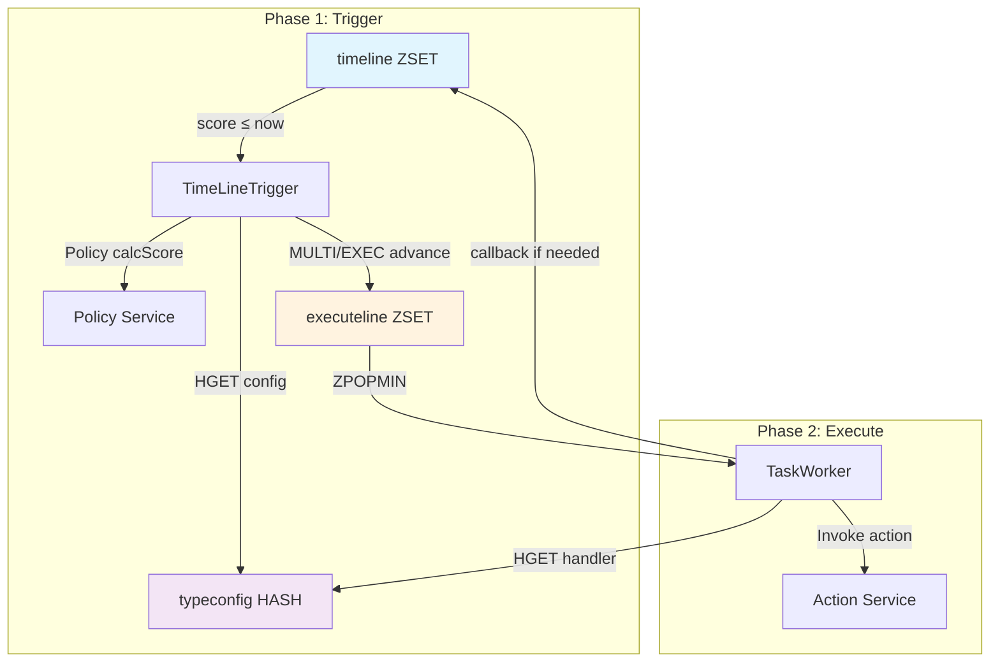

---

## Task Lifecycle

Complete lifecycle from registration to execution:

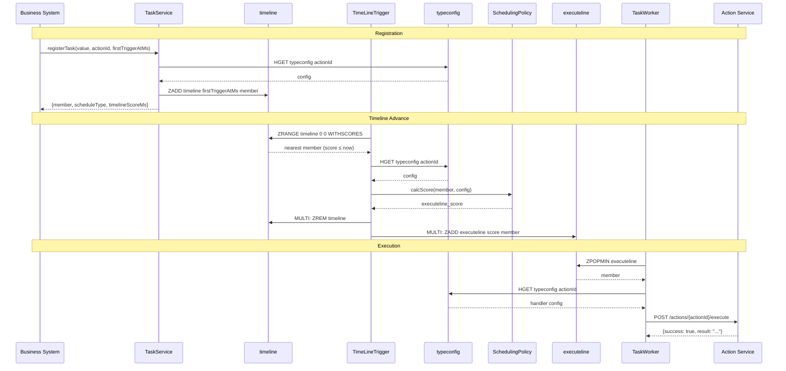

---

## Schedule Type Behaviors

### once (One-time execution)

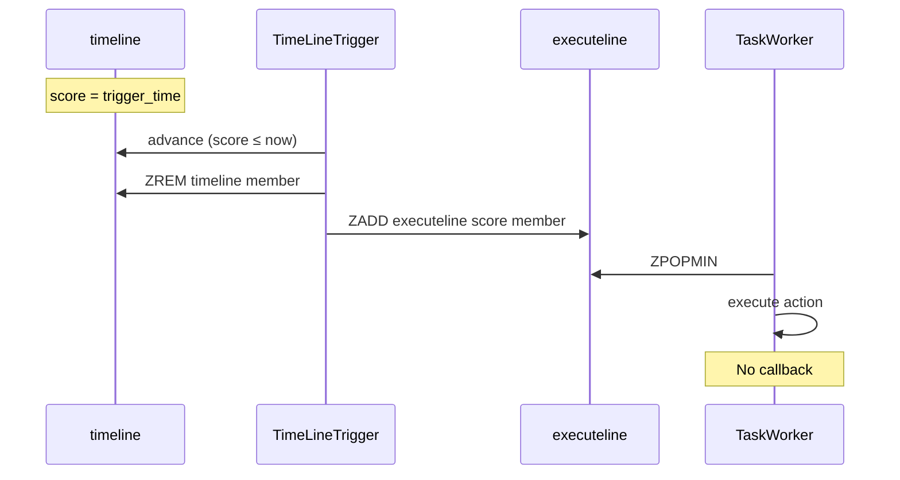

**Behavior:** Task executes once and is removed from the system.

---

### interval (Fixed interval)

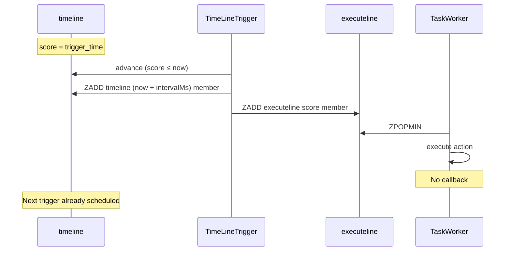

**Behavior:** Next trigger time is written at advance (`now + intervalMs`). No callback needed.

---

### cron (Cron expression)

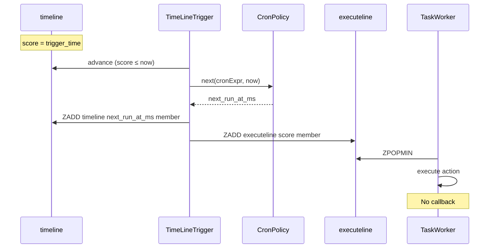

**Behavior:** Next trigger calculated from cron expression at advance time.

---

### fixed_delay (Fixed delay after completion)

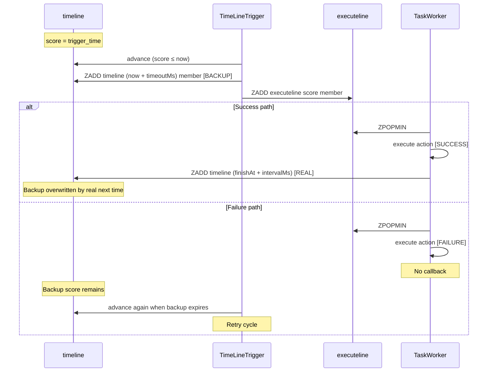

**Behavior:**
- Advance writes a **backup** score (`now + timeoutMs`)
- On success, callback overwrites with **real** next time (`finishAt + intervalMs`)
- On failure, backup expires and TimeLineTrigger retries

---

## Policy Score Calculation

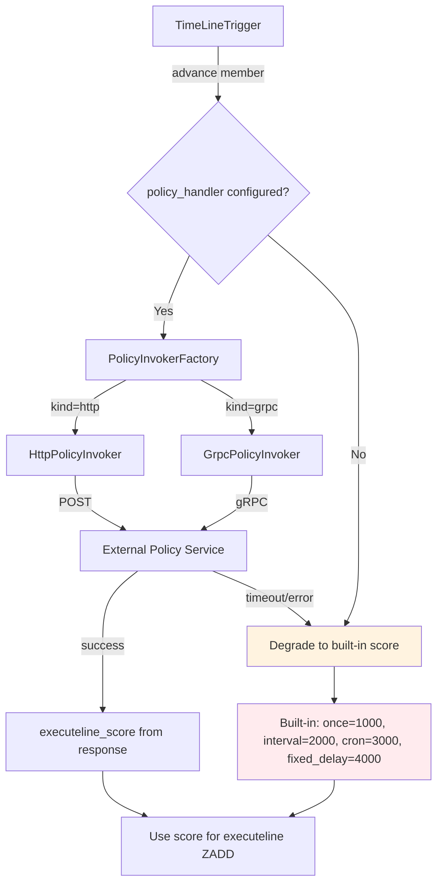

**Degradation:** Policy failures never block advance. Built-in defaults ensure progress.

---

## Action Invocation

### HTTP Action

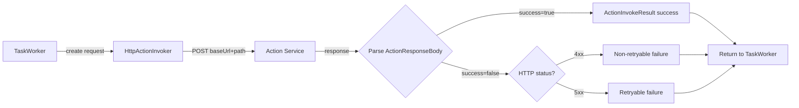

**Retry classification:**
- `success=true` → success
- `success=false` + HTTP 4xx → non-retryable
- `success=false` + HTTP 5xx → retryable
- Invalid response → retryable

### gRPC Action

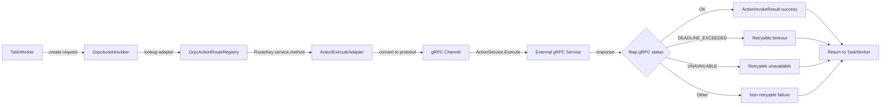

**Route Registry:** Only pre-registered `service/method` combinations are accepted.

---

## Event Flow

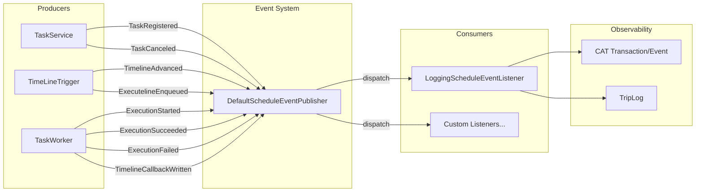

**Event types:**
1. `TaskRegistered` — task added to timeline
2. `TaskCanceled` — task removed from timeline/executeline
3. `TimelineAdvanced` — task advanced from timeline to executeline
4. `ExecutelineEnqueued` — task entered executeline
5. `ExecutionStarted` — TaskWorker began execution
6. `ExecutionSucceeded` — action completed successfully
7. `ExecutionFailed` — action failed after retries
8. `TimelineCallbackWritten` — fixed_delay callback wrote next timeline score

---

## Admin REST Request Flow

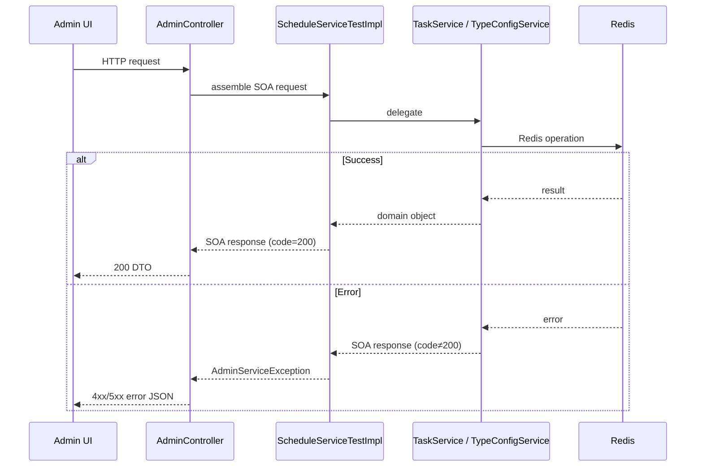

**Layer mapping:**
- Admin REST → SOA → Service → Repository
- Admin REST is a thin adapter; all logic in SOA/Service layer

---

## Startup Sequence

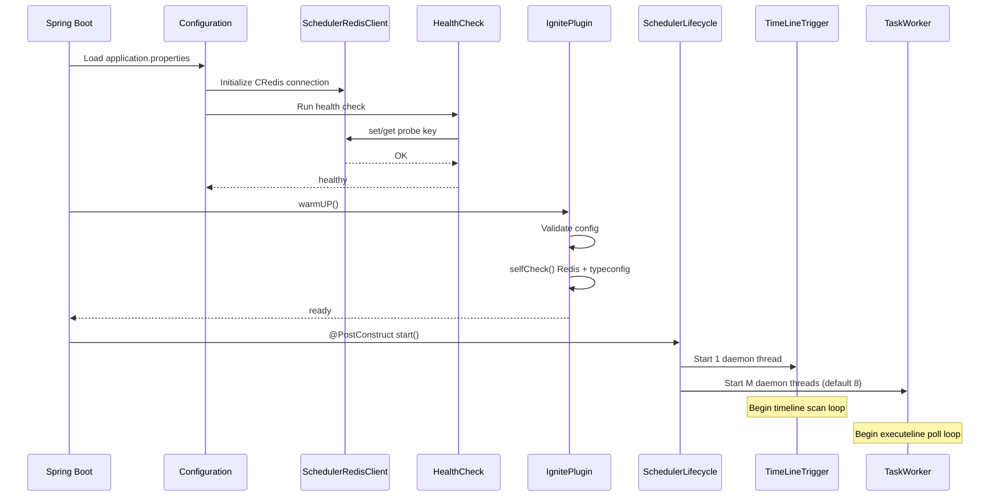

---

## Error Handling Flow

### Task Registration Errors

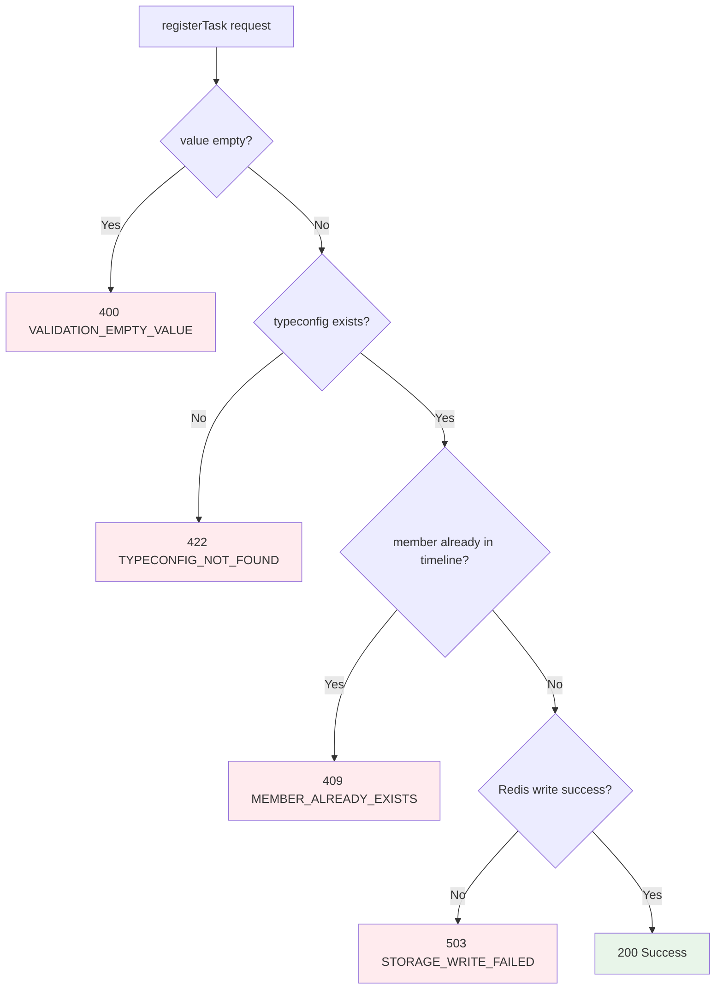

### Action Invocation Errors

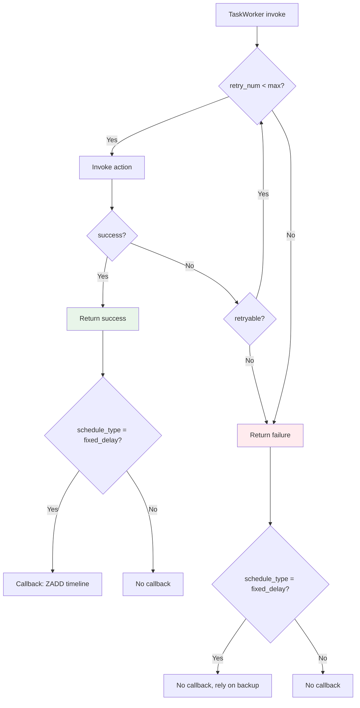

---

## gRPC Channel Management

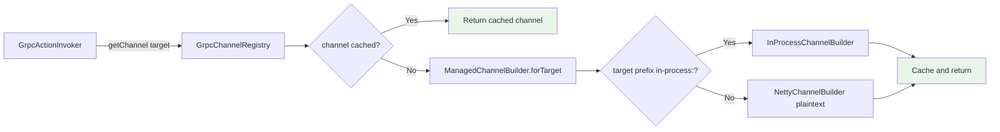

**Channel pooling:** Channels are cached by target string and reused across invocations.

---

## Configuration Validation

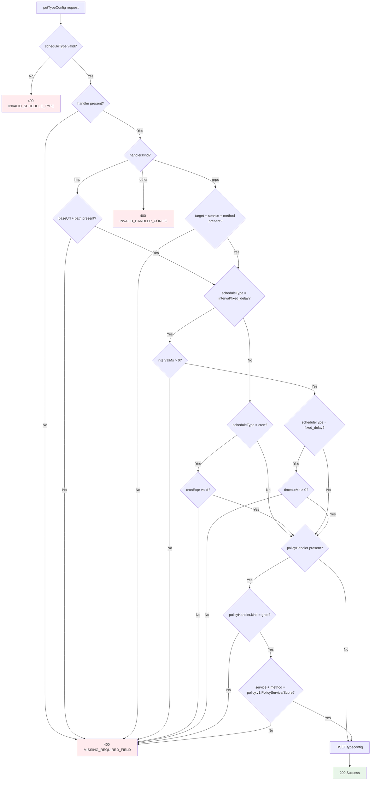

---

## Monitoring Query Patterns

### Dashboard Aggregation

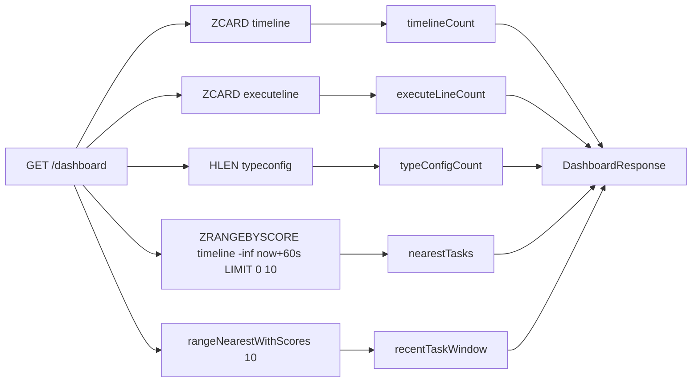

### Timeline Monitor

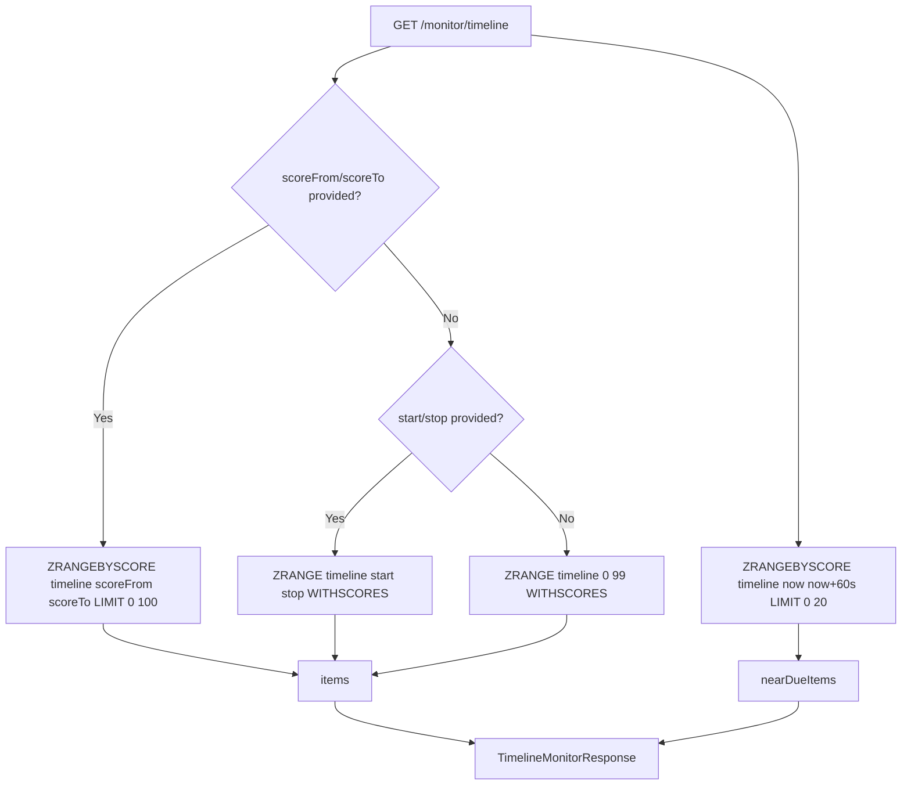

---

## Summary

The scheduler implements a **two-queue model** with Redis as the sole persistence layer:

1. **timeline** — when to trigger (score = timestamp)
2. **executeline** — what to execute now (score = priority)

The **TimeLineTrigger** advances due tasks atomically via MULTI/EXEC, while **TaskWorker** executes them with retry logic. **Policy services** optionally determine execution priority, with graceful degradation to built-in defaults.

The system supports four schedule types (once, interval, cron, fixed_delay), each with distinct advance and callback behaviors. All operations are observable via a synchronous event system with 7 event types covering the full task lifecycle.
